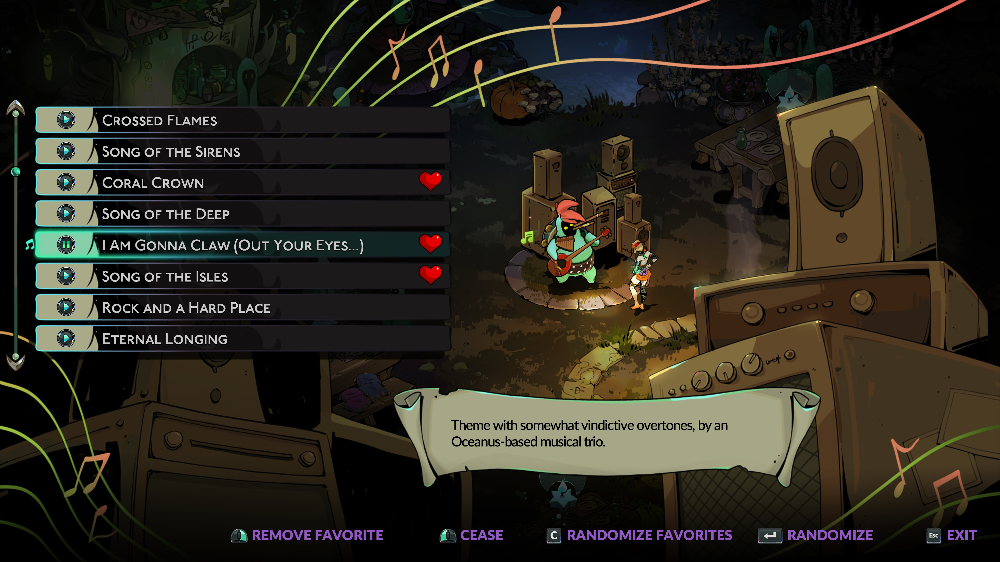

# Randomize Favorite Songs

This mod allows you to mark songs as favorites with the Music Maker, and randomize from those songs only - instead of all songs - after unlocking the incantation that allows randomizing songs.

Simply mark a song as favorite using the same button as for pinning incantations and recipes, and randomize from your favorites using the "Open Inventory" button.

Will work with any songs added in the future, or through other mods.

> If you favorite modded songs and then remove the mod(s) that added them, they will be unfavorited, even if you later reinstall those mods.
> You will need to re-add them as favorites then.

## Other related mods

To further improve your musical experience in the Crossroads, consider installing some of my other mods:

- [Crossroads Singing Sirens](https://thunderstore.io/c/hades-ii/p/NikkelM/Crossroads_Singing_Sirens/) adds lyrical and hummed versions of the songs by Scylla and the Sirens to the Music Maker.
- [Crossroads Singing Silver Sisters](https://thunderstore.io/c/hades-ii/p/NikkelM/Crossroads_Singing_Silver_Sisters/) adds lyrical versions of the songs by Artemis, Melinoë and Apollo to the Music Maker.
- [Hades OST for the Music Maker](https://thunderstore.io/c/hades-ii/p/NikkelM/Hades_OST_for_the_Music_Maker/) adds songs from the Hades soundtrack (as played by Orpheus) to the Music Maker.

## Contribute

You can contribute to this mod by providing a translation for your native language!
To do so, follow these steps:

- Open the `src/Game/Text/ScreenText.<language>.sjson.lua` file, where `<language>` is the shorthand of the language you would like to translate (e.g. `de` for German).
- Remove the leading `--` from all lines in the `newData` table.
- Translate the `DisplayName` entries. Do not change the `Id` values!
- The character limit in the game is 20 for anything after the `{XX}` entries, which are placeholders for button icons. Do not change the `{XX}` texts.
- Open a Pull Request with your changes, or ping @NikkelM in the [Hades Modding Discord](https://discordapp.com/invite/KuMbyrN).

The mod is currently available in the following languages:

- English
- German
